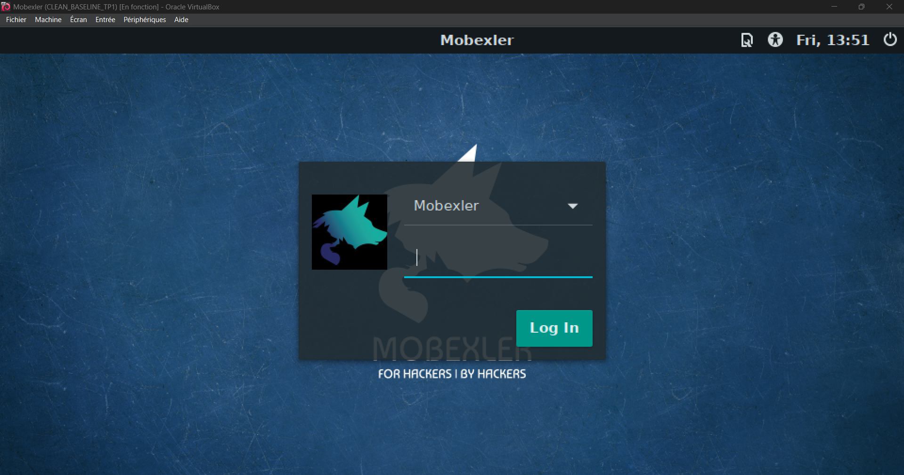
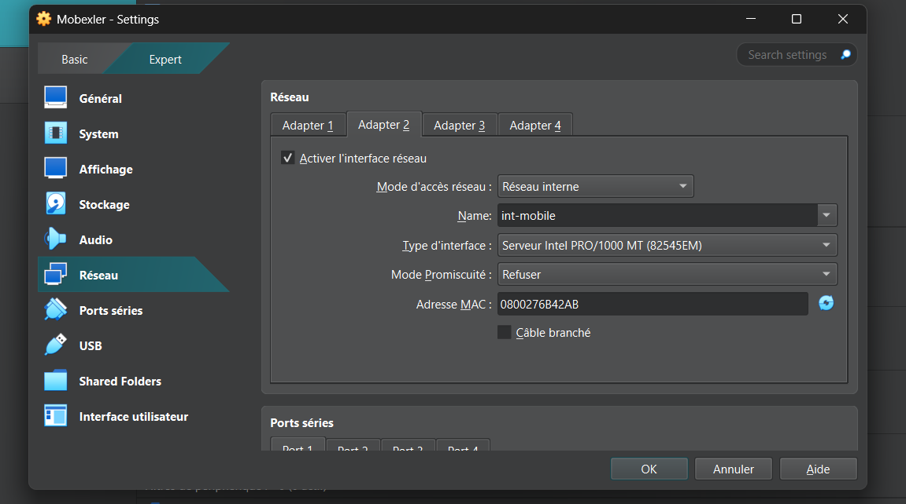
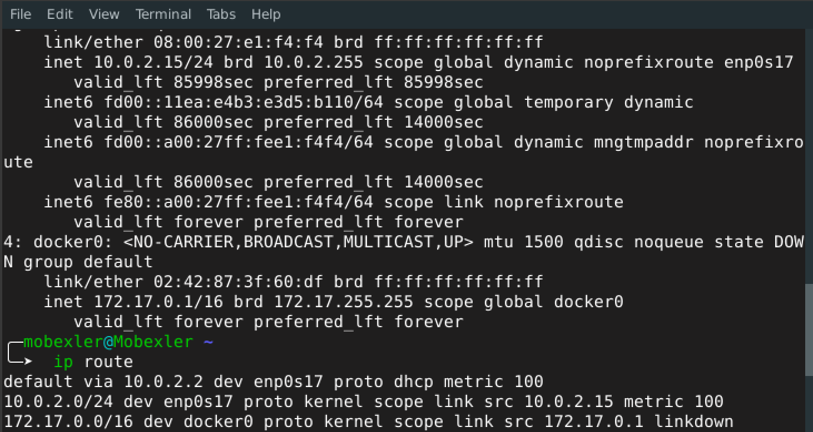
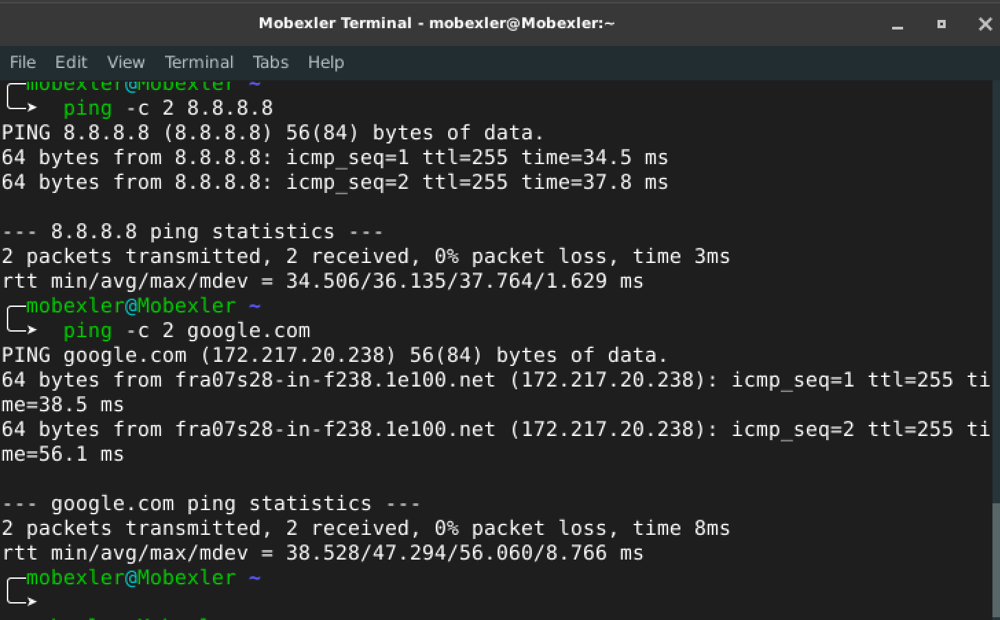
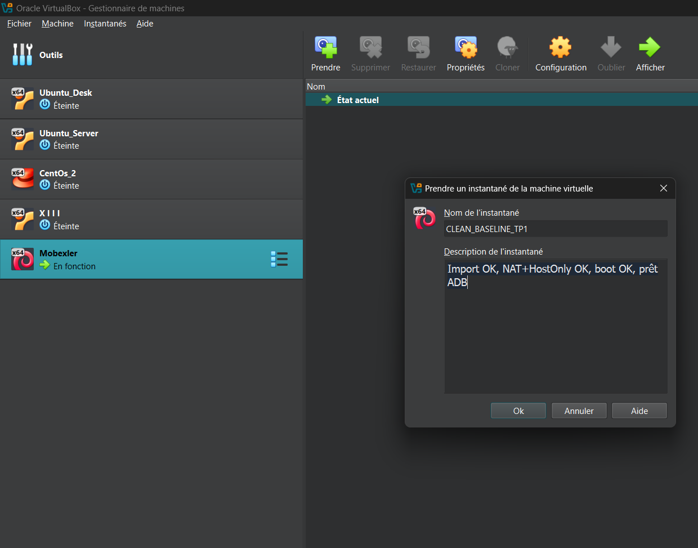
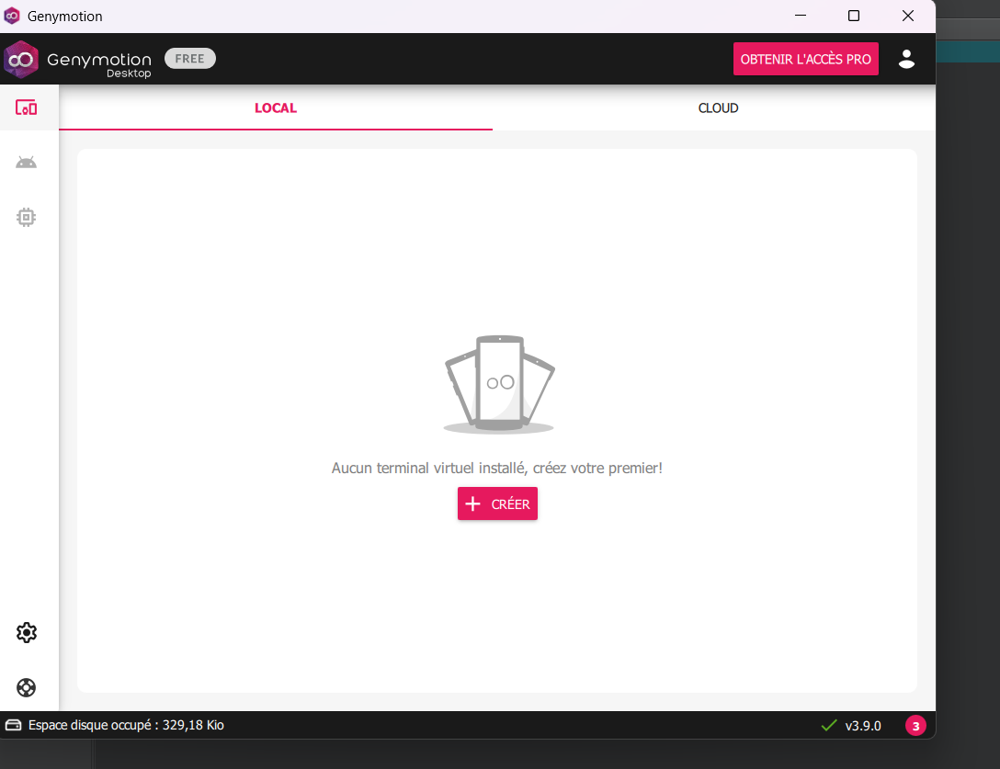
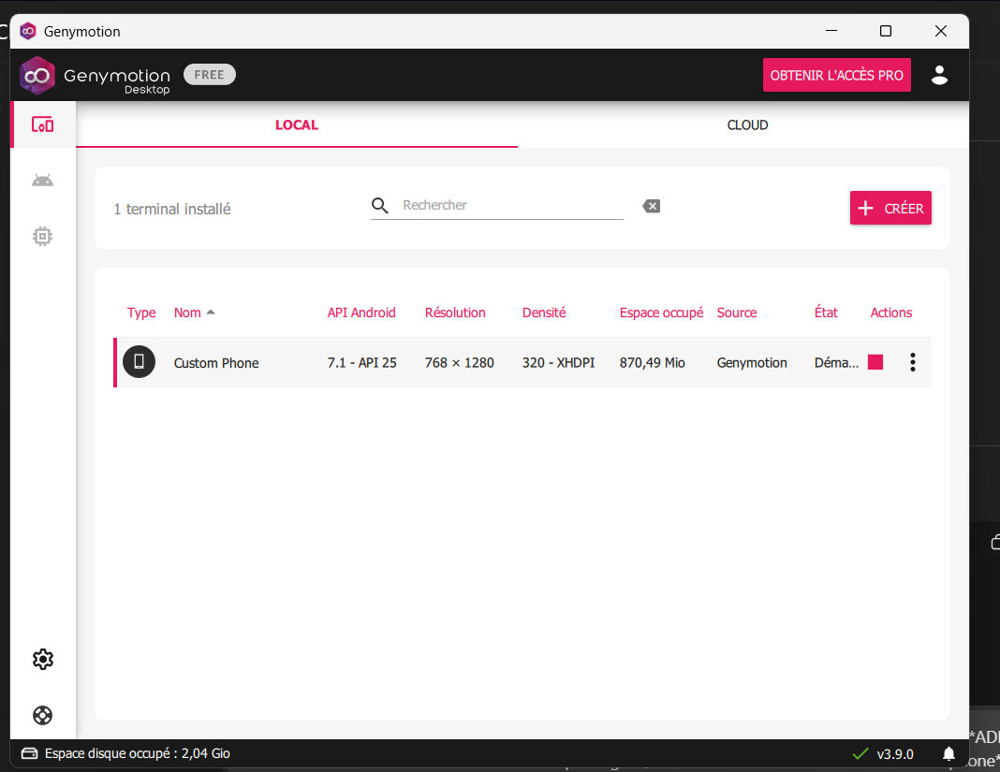
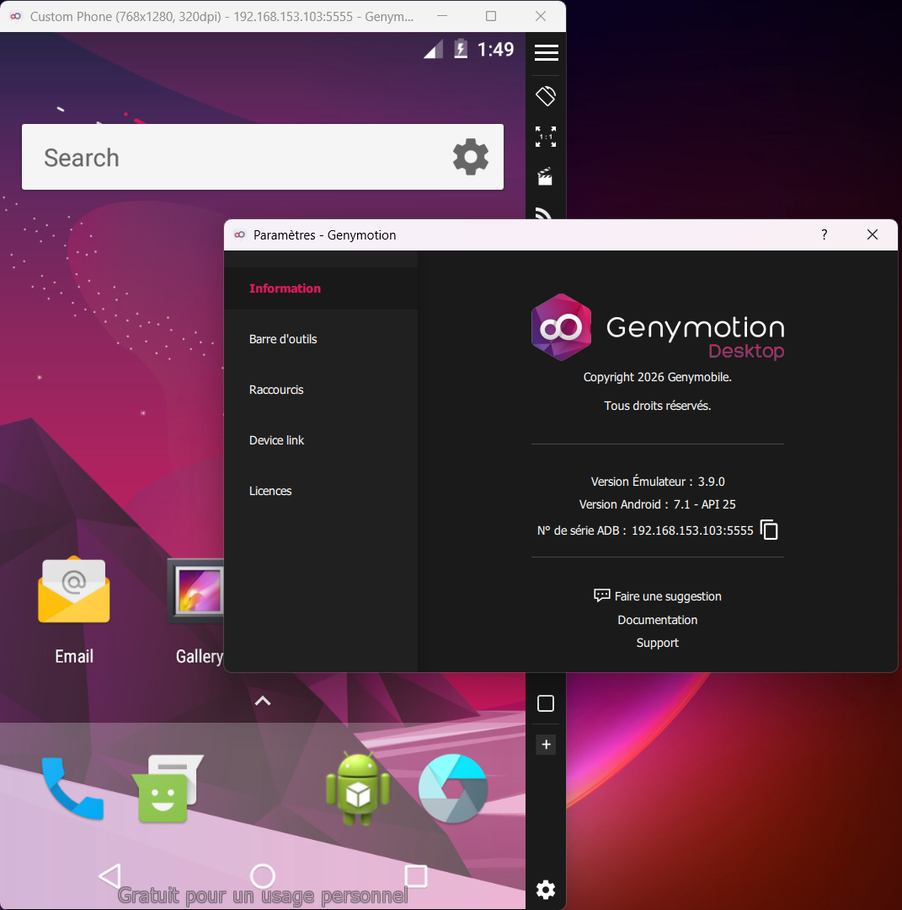
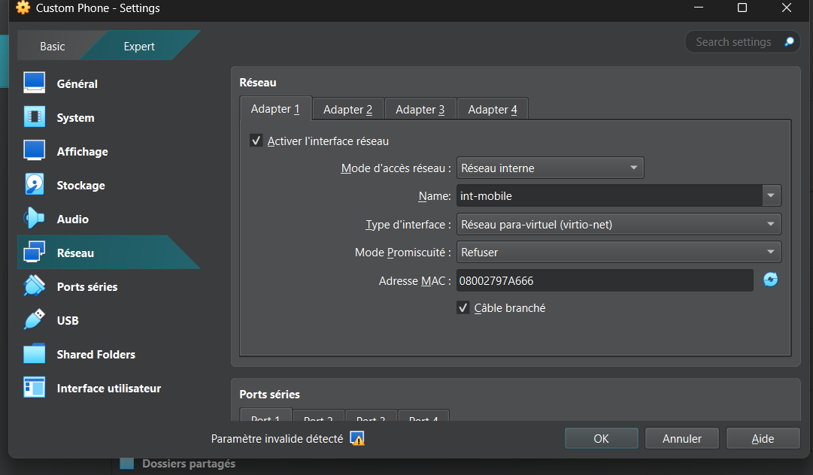
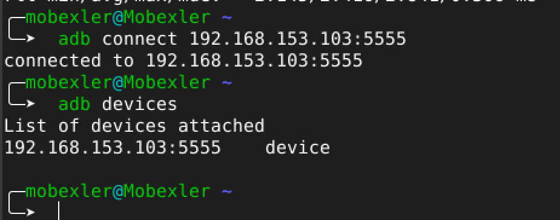

# LAB 1 : Mise en place du lab (Mobexler + snapshot clean)

Ce répertoire contient l’ensemble des captures d’écran décrivant les étapes qui nous ont permis 
d’atteindre l’objectif de ce lab, à savoir la mise en place d’un environnement de travail destiné au 
test de la sécurité des applications mobiles en utilisant Mobexler.

Nous avons commencé par télécharger l’image de Mobexler et l’importer dans VirtualBox, puis la configurer correctement en mettant en place un adaptateur réseau en mode Réseau interne (nommé int-mobile), qui sera utilisé par la suite pour se connecter à l’appareil cible.

Je note qu'on a un un second adaptateur réseau en mode NAT afin d’établir une connexion Internet que nous allons tester.

 

Avant de commencer tout type de test sur notre machine virtuelle, nous créons un snapshot de l’état « clean » actuel
de Mobexler. Cela nous permet de revenir facilement à un état stable en cas d’erreur critique lors de la configuration,
qui peut corrompre la machine virtuelle ou de compromettre son fonctionnement.

Malheuresement je ne dispose pas d’un appareil Android physique, donc j'ai opté pour la seconde solution recommandée, qui consiste à utiliser Genymotion. Après la création d’un compte Genymotion, j'ai procédé à la création d’un téléphone virtuel de type Custom, plus léger que les appareils récents proposés par l’application ce qui va permettre de tester correctement l’interconnexion entre Mobexler et Genymotion via un réseau interne, en utilisant le même réseau int-mobile configuré sur le deuxième adaptateur réseau de Mobexler. Ce réseau interne assure la communication directe entre les machines virtuelles.

Pour le dernier test, nous avons vérifié la communication entre Mobexler et le téléphone virtuel Genymotion en utilisant ADB, nous avons exécuté la commande adb connect afin d’établir une connexion avec l’appareil Android via son adresse IP et le port 5555 et qui va étre comfirmer lors de l'éxecution de la commandes adb devices qui va afficher l’appareil dans la liste retournée.

